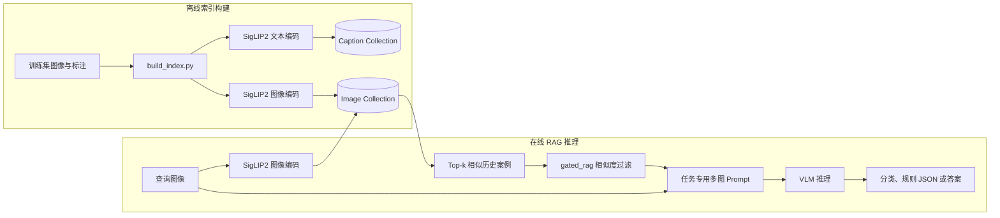

# Image_RAG：面向安全场景理解的多模态检索增强生成系统

Image_RAG 是一个面向施工现场与实验室安全分析的本地多模态 RAG（Retrieval-Augmented Generation，检索增强生成）系统。系统接收一张待检查图像，使用 SigLIP2 将图像编码为向量，从 ChromaDB 中检索视觉上相似且带有人工标注的历史案例，再将“历史参考图像 + 参考标注 + 查询图像”共同输入视觉语言模型（VLM），完成安全分类、隐患识别、规则判断或多项选择问答。

本仓库以 **InspecSafe-V1 施工安全二分类**为起点，目前已扩展到 ConstructionSite-10K 规则检测、Lab Safety 多项选择问答、合成实验室场景危险分类，并提供索引构建、相似度门控 RAG、InspecSafe 两阶段确认推理、离线评估、REST API、低开销原始图像推理服务及推理结果转发功能。

> 项目面向 AutoDL Linux GPU 主机运行。SigLIP2、VLM 和 SBERT 均通过 `config.py` 指向本地模型快照；SigLIP2 加载显式启用 Hugging Face/Transformers 离线模式。

## 1. 项目目标与研究问题

通用视觉语言模型能够直接判断图像内容，但在专业安全检查中可能缺少领域知识、标签口径和可复用的历史经验。本项目尝试通过图像 RAG 回答以下问题：

1. 将相似的已标注安全案例作为上下文，能否提高 VLM 对专业安全场景的判断能力？
2. 视觉相似度检索能否为分类结果提供可追溯的案例依据？
3. 同一套“视觉编码—向量检索—多图提示—VLM 推理”框架能否适配不同任务和数据格式？
4. Baseline（只看查询图像）与 RAG（同时参考历史案例）在准确率、规则识别和生成质量上有何差异？

系统的核心设计不是用检索结果替代查询图像，而是始终以查询图像为主要证据，以检索案例校准风险模式、类别边界和输出格式。

## 2. 系统能力概览

- 使用同一个本地 SigLIP2 模型编码文本、图像和查询图像；
- 使用 ChromaDB 持久化两类余弦相似度 HNSW 索引；
- 支持文本到文本、文本到图像、图像到图像以及 RRF 混合检索；
- 支持在 Top-k 检索后通过 `gated_rag` 余弦相似度阈值过滤参考案例，并允许最终参考数为 0；
- 将检索到的参考图像作为真实多模态内容块传给 VLM，而不是只传图片路径；
- 支持 Qwen2.5-VL、Gemma 3 和 InternVL 三类推理后端；
- 支持四类安全任务和各自独立的提示模板、索引及评估指标；
- 提供完整 FastAPI 接口和轻量级原始图像字节接口；
- 支持 Baseline/RAG 对照评估、结果 JSON 保存和案例可视化导出；
- 支持 InspecSafe 两阶段门控推理，仅在两次判断均为 `unsafe` 时返回隐患 annotation；
- 支持推理结果异步转发至另一台 HTTP 服务器。

## 3. 总体架构



系统分为两个阶段：

### 3.1 离线阶段：建立领域案例库

`build_index.py` 读取训练集，将不同数据格式统一转换为至少包含 `id`、`image_path`、`caption`、`safe_label` 的表结构。每条样本生成两种 L2 归一化向量：

- 文本向量：由 caption 或结构化标注文本编码，写入 `siglip2_caption_rag`；
- 图像向量：由原始图像编码，写入 `siglip2_image_rag`。

两个集合均使用 ChromaDB 的余弦距离和 HNSW 索引。不同数据集存放在独立目录中，避免互相覆盖：

```text
chroma_db/
├── inspecsafe/
├── constructionsite10k/
├── lab_safety/
└── lab_safety_gen/
```

默认 `RESET_COLLECTIONS_ON_BUILD = True`，因此重建某个数据集时会删除并重建该数据集下的两个集合。更换嵌入模型后必须重新建立索引，旧向量与新编码器不兼容。

### 3.2 在线阶段：检索增强推理

完整 RAG 推理执行以下步骤：

1. 校验任务类型和查询图像路径；
2. 使用 SigLIP2 编码查询图像；
3. 在当前任务对应的图像集合中执行 Top-k 视觉近邻搜索；
4. 计算 `similarity = 1 - cosine distance`，过滤 `similarity < gated_rag` 的结果；
5. 读取剩余参考案例的图像、caption、标签和任务专用元数据；
6. 将参考图像与文本标注交错排列，最后加入查询图像；若没有剩余案例，则只使用查询图像；
7. 调用任务专用提示模板和 VLM 生成结果；
8. 返回查询信息、过滤后的检索案例、过滤前后数量、完整 prompt/messages 和模型输出。

需要注意：`VLM_inference_with_RAG()` 当前使用的是**图像到图像检索**。文本检索和混合检索是独立 API 能力，`/rag/answer` 只构造基于文本混合检索的提示，不执行 VLM。

## 4. 检索方法

| 方法 | 查询编码 | 目标集合 | 用途 |
|---|---|---|---|
| Caption search | 文本 | Caption collection | 查找语义相似的历史描述 |
| Text-to-image search | 文本 | Image collection | 利用 SigLIP2 跨模态空间查找匹配图像 |
| Query-image search | 图像 | Image collection | 查找视觉上相似的历史图像；完整 RAG 默认使用此方法 |
| Hybrid search | 文本 | Caption + Image collections | 对两组排序执行 Reciprocal Rank Fusion |

混合检索不直接合并不同距离，而使用倒数排名融合：

```text
RRF_score(d) = Σ 1 / (60 + rank_i(d))
```

这样可以避免文本集合距离与跨模态图像集合距离的量纲差异。结果还会记录 `matched_by`，说明案例来自 caption、image 或两种检索通道。

### 4.1 Top-k 后相似度门控

所有 RAG 推理入口都支持 `gated_rag`，默认值为 `0`。门控的优先级高于 Top-k：系统先完成 Top-k 排序和截取，再保留满足以下条件的案例：

```text
similarity = 1 - cosine_distance
similarity >= gated_rag
```

阈值相等的案例会被保留。过滤后允许剩余 0 条参考案例，此时 VLM 仍会使用任务提示和查询图像完成推理。返回结果中的 `retrieved` 始终是实际进入 prompt 的案例，并额外包含 `retrieved_count_before_gate`、`retrieved_count` 和 `gated_rag` 便于调试。

## 5. 支持的数据集与任务

| 数据集/任务 | `task_type` | 输入与目标 | RAG 输出要求 | 主要评估指标 |
|---|---|---|---|---|
| InspecSafe-V1 | `safety judgement` | 施工图像；`safe` / `unsafe` | 观察、参考证据、推理、最终标签 | Accuracy、TP/FP/TN/FN |
| InspecSafe-V1 Safety Level | `safety level` | 巡检图像；Level I-IV、危险项与场景描述 | 结构化 JSON | Level Accuracy、Macro/Micro F1、Hazard F1、SBERT |
| ConstructionSite-10K | `constructionsite10k` | 施工图像；规则 1–4 违规集合 | 严格 JSON：场景 annotation 与 violations | Exact Match、safe/unsafe、宏/微 P/R/F1、ROUGE-L、SBERT |
| Lab Safety | `lab_safety` | 实验室图像与多项选择题；A/B/C/D | 仅输出一个大写选项字母 | Accuracy、解析失败数、混淆矩阵 |
| LabSafety-v1 Generated | `lab_safety_gen` | 合成实验室图像；`hazardous` / `non-hazardous` | 观察、检索证据、推理、最终标签 | Accuracy、TP/FP/TN/FN、Hazard F1 |

### 5.1 InspecSafe-V1

最初的核心任务。训练样本需要提供图像 caption 与 `safe`/`unsafe` 标签。RAG prompt 会显示每张参考图像、caption 和历史标签，并要求模型只对最后的查询图像分类。

InspecSafe 还提供两阶段确认推理：第一阶段最多生成 8 个新 token，只请求 `safe` 或 `unsafe`；仅当第一阶段为 `unsafe` 时执行第二阶段。第二阶段最多生成 128 个新 token，并返回简短 annotation 与再次判断。只有两阶段均判断为 `unsafe` 时最终结果才是 `unsafe` 并保留 annotation，其他情况均归一化为 `safe` 且 annotation 为空。

CSV 至少包含：

```text
id,image_path,caption,safe_label
```

其中 `id` 必须唯一；相对图片路径以仓库根目录为基准解析。

### 5.2 ConstructionSite-10K

模型依据四类规则检查施工现场：

1. 个人防护装备（PPE）；
2. 3 米及以上高处作业安全带；
3. 深基坑边缘防护；
4. 挖掘机盲区与作业半径。

数据加载器从对话式 JSON 的 assistant 答案中提取 `annotation` 和 `violations`，并将违规规则集合、原因与安全标签写入索引元数据。输出要求为严格 JSON，便于进行逐规则评估。

### 5.3 Lab Safety

该任务是图像多项选择问答。索引文本由问题、正确选项、解释、类别和难度组成。模型最终只能输出 `A`、`B`、`C` 或 `D`，适合直接计算准确率和混淆矩阵。

### 5.4 LabSafety-v1 Generated

该数据集为合成实验室场景二分类任务。JSONL 可包含 `description`、`hazards`、`vlm_label`、`agree` 等字段，其中 `safety_label` 才是评估目标；其他字段作为参考元数据保存。仓库内数据说明记录了 1,092 张图像，其中训练集 928 张、测试集 164 张，类别为 321 张 hazardous 和 771 张 non-hazardous。

## 6. 核心模块

| 文件 | 作用 |
|---|---|
| `config.py` | 模型路径、索引目录、集合名称、任务映射、Top-k、生成参数和转发配置 |
| `embedding.py` | 本地 SigLIP2 加载；文本/图像批量编码；特征 L2 归一化；离线模式控制 |
| `build_index.py` | 解析四种数据格式，批量生成向量并建立 ChromaDB 索引 |
| `retriever.py` | 四类检索、Top-k 校验、数据集索引选择、结果格式化与调试图片复制 |
| `retrieval_gating.py` | Top-k 后余弦相似度门控、阈值校验与过滤结果标准化 |
| `rag_answer.py` | 通用和任务专用多图 RAG messages/prompt 构造 |
| `two_stage_inference.py` | 可独立测试的 InspecSafe 两阶段提示、标签解析和门控决策策略 |
| `vlm_inference.py` | VLM 后端选择、Baseline/RAG/两阶段推理入口、模型缓存与批量 CLI |
| `app.py` | 完整 JSON FastAPI：检索、prompt 构造和 VLM 推理 |
| `image_server.py` | 接收原始图片字节的轻量服务；预加载、串行 GPU 推理和可选结果转发 |
| `response_forwarding.py` | 推理结束后异步 POST 文本结果，失败不影响主请求 |
| `response_receiver.py` | 用标准库实现的结果接收与落盘测试服务器 |
| `evaluate_*.py` | 四项任务的 Baseline/RAG 批量推理与指标计算 |
| `utils/evaluate_utils.py` | 标签解析、混淆矩阵、规则指标、ROUGE-L 与 SBERT 等公共评估逻辑 |
| `utils/evaluate_rag_details.py` | 从评估 JSON 导出查询图、检索图、prompt、预测和真值，便于案例分析 |
| `preprocess/` | InspecSafe 数据转换和平衡脚本 |
| `constructionsite_10k/` | ConstructionSite-10K 的微调、评估、模型下载辅助脚本和数据划分 |
| `docs/` | 测试、各数据集实验流程、提示模板和图像服务说明 |

## 7. 模型与技术栈

### 7.1 检索编码器

SigLIP2 同时提供 `get_text_features()` 和 `get_image_features()`，因此文本与图像可映射到同一语义空间。实现会：

- 自动选择 CUDA 或 CPU；
- 根据模型、文本配置或 tokenizer 推断最大文本长度；
- 对文本和图像特征做 L2 归一化；
- 使用 `lru_cache` 避免重复加载模型、tokenizer 和图像处理器；
- 通过 `local_files_only=True`、`HF_HUB_OFFLINE=1` 和 `TRANSFORMERS_OFFLINE=1` 禁止下载缺失模型文件。

### 7.2 向量数据库

ChromaDB 以持久化方式保存向量，集合元数据记录：

```text
hnsw:space = cosine
embedding_model = <EMBED_MODEL_PATH>
```

### 7.3 视觉语言模型

默认模型是 Qwen2.5-VL 3B。代码会根据 `VLM_MODEL_PATH` 和 `VLM_PROCESSOR_PATH` 中的名称自动选择后端：

- 包含 `gemma`：`Gemma3ForConditionalGeneration`；
- 包含 `internvl`：InternVL 的 `AutoModel.chat()` 路径；
- 其他情况：`Qwen2_5_VLForConditionalGeneration`。

三种后端共用上层任务接口，但图像预处理和消息适配分别实现。模型组件同样通过 `lru_cache` 常驻内存。`VLM_USE_FLASH_ATTENTION` 可控制是否启用 FlashAttention 2。

### 7.4 主要依赖

Python 3.10+、PyTorch 2.0+、Transformers 4.50–4.x、Accelerate、ChromaDB、FastAPI、Pillow、pandas、qwen-vl-utils、SentenceTransformers、ROUGE Score、timm 和 torchvision。

## 8. 环境与配置

默认本地路径位于 `config.py`：

```python
EMBED_MODEL_PATH = "/root/autodl-tmp/model/siglip2"
VLM_MODEL_PATH = "/root/autodl-tmp/model/qwenvl_2_5_3B"
SBERT_MODEL_PATH = "/root/autodl-tmp/model/all-MiniLM-L6-v2/sentence-transformers/all-MiniLM-L6-v2"

EMBED_BATCH_SIZE = 128
TOP_K = 5
MAX_TOP_K = 50
GATED_RAG = 0.0
VLM_MAX_NEW_TOKENS = 2048
VLM_USE_FLASH_ATTENTION = False
INSPECSAFE_STAGE_ONE_MAX_NEW_TOKENS = 8
INSPECSAFE_STAGE_TWO_MAX_NEW_TOKENS = 128
```

根据实际服务器修改模型路径。建议将训练集、测试集和模型全部放在本地磁盘，避免运行过程中依赖公网。

使用本地 wheelhouse 安装依赖：

```bash
python -m venv .venv
source .venv/bin/activate
python -m pip install --no-index \
  --find-links /path/to/local/wheelhouse \
  -r requirements.txt
```

基础检查：

```bash
python -m compileall \
  app.py build_index.py config.py embedding.py rag_answer.py \
  retrieval_gating.py retriever.py two_stage_inference.py \
  vlm_inference.py image_server.py \
  response_forwarding.py response_receiver.py

python -m unittest test_retrieval_gating.py test_two_stage_inference.py

python -c "import chromadb, torch, transformers, qwen_vl_utils; print('deps ok')"
python -c "from embedding import encode_query; print(len(encode_query('worker wearing a helmet')))"
```

## 9. 快速开始

### 9.1 建立索引

推荐仅用训练集建立 RAG 案例库，测试集只用于评估，以避免数据泄漏。

```bash
# InspecSafe
python build_index.py --dataset-csv data/inspecsafe/train.csv

# ConstructionSite-10K
python build_index.py --constructionsite-json constructionsite_10k/train.json

# Lab Safety 多项选择
python build_index.py --lab-safety-json data/lab_safety/lab_train.json

# 合成 Lab Safety；可选 train、test 或 all，实验应使用 train
python build_index.py \
  --lab-safety-gen-jsonl data/lab_safety_gen/annotations.jsonl \
  --split train
```

### 9.2 Python 推理

```python
from vlm_inference import (
    VLM_inference,
    VLM_inference_two_stage,
    VLM_inference_with_RAG,
)

image = "data/inspecsafe/images/example.jpg"

baseline = VLM_inference(
    "safety judgement",
    image,
)

rag = VLM_inference_with_RAG(
    "safety judgement",
    image,
    top_k=5,
    gated_rag=0.3,
)

two_stage = VLM_inference_two_stage(
    "safety judgement",
    image,
)

print(baseline["output"])
print(rag["retrieved"])
print(rag["retrieved_count_before_gate"], rag["retrieved_count"])
print(rag["output"])
print(two_stage["label"], two_stage["annotation"])
```

Baseline 返回 `task_type`、`query_image`、`query`、`prompt` 和 `output`；RAG 另外返回门控后的 `retrieved`、`gated_rag` 和过滤前后数量，且 `prompt` 是包含实际参考图像内容块的 messages 列表。两阶段接口返回最终 `label`、`annotation` 以及可调试的 `stage_one`、`stage_two` 原始结果。

### 9.3 批量 CLI

当前 `vlm_inference.py` 的 CLI 面向 InspecSafe CSV 批量运行，不是单张图片位置参数接口：

```bash
# RAG：运行前 10 条
python vlm_inference.py \
  --dataset-csv data/inspecsafe/test.csv \
  --top-k 5 --gated_rag 0.3 --limit 10

# Baseline：跳过前 20 条，再运行 10 条
python vlm_inference.py \
  --dataset-csv data/inspecsafe/test.csv \
  --baseline --offset 20 --limit 10
```

单张图片建议使用 Python API、`app.py` 或 `image_server.py`。

## 10. 完整 FastAPI

启动：

```bash
uvicorn app:app --host 0.0.0.0 --port 8000
```

| 方法 | 路径 | 功能 |
|---|---|---|
| GET | `/health` | 存活检查 |
| POST | `/search/caption` | 文本到 caption 检索；`test_mode` 可复制结果图到 `demo/` |
| POST | `/search/image` | 文本到图像检索 |
| POST | `/search/query-image` | 查询图像到历史图像检索 |
| POST | `/search/hybrid` | 文本驱动的 caption/image RRF 混合检索 |
| POST | `/rag/answer` | 混合检索、`gated_rag` 过滤并构造文本 RAG prompt，不运行 VLM |
| POST | `/vlm/inference` | 单图 Baseline VLM 推理 |
| POST | `/vlm/rag-inference` | 图像检索 + 多图 prompt + VLM 的完整流程 |
| POST | `/vlm/two-stage-inference` | InspecSafe 两阶段确认推理，不使用检索 |

检索请求示例：

```bash
curl -X POST http://127.0.0.1:8000/search/query-image \
  -H "Content-Type: application/json" \
  -d '{"query_image":"data/query.jpg","top_k":5}'
```

完整 RAG 推理示例：

```bash
curl -X POST http://127.0.0.1:8000/vlm/rag-inference \
  -H "Content-Type: application/json" \
  -d '{
    "task_type":"safety judgement",
    "query_image":"data/query.jpg",
    "query":"Is the following image a safe scenario?",
    "top_k":5,
    "gated_rag":0.3,
    "max_new_tokens":1024
  }'
```

`top_k` 的合法范围为 1–50；`gated_rag` 默认为 `0`，在 Top-k 完成后过滤低相似度案例。`query_image` 是服务器本地文件路径，而不是上传字段。

InspecSafe 两阶段推理示例：

```bash
curl -X POST http://127.0.0.1:8000/vlm/two-stage-inference \
  -H "Content-Type: application/json" \
  -d '{"query_image":"data/query.jpg"}'
```

响应始终包含 `label`、`annotation`、`stage_one` 和 `stage_two`。第一阶段未输出 `unsafe` 时，`stage_two` 为 `null`。

## 11. 原始图像推理服务

`image_server.py` 适合跨机器直接上传图像字节，避免客户端必须知道服务器文件路径。它支持启动时预加载模型、限制上传大小、单 GPU 推理锁、请求耗时统计和后台结果转发。

纯 VLM 模式：

```bash
python image_server.py --host 0.0.0.0 --port 8000 --dataset inspecsafe
```

RAG 模式：

```bash
python image_server.py \
  --host 0.0.0.0 --port 8000 \
  --rag --dataset inspecsafe --top-k 5 --gated_rag 0.3
```

发送原始图片：

```bash
curl --data-binary @query.jpg \
  -H "Content-Type: image/jpeg" \
  "http://127.0.0.1:8000/infer?dataset=inspecsafe&top_k=5&gated_rag=0.3"
```

可按请求切换 `inspecsafe`、`construction_site` 或 `lab_safety_gen`。该轻量接口当前不暴露 Lab Safety 多项选择任务。返回格式为：

```json
{
  "dataset": "inspecsafe",
  "response": "Query image observations: ...",
  "response_time_seconds": 2.731,
  "gated_rag": 0.3,
  "retrieved_count_before_gate": 5,
  "retrieved_count": 2
}
```

服务使用异步锁保证同一时刻只有一个 GPU 推理，降低并发请求导致显存耗尽的风险；额外请求会在进程内等待。生产部署仍应在上游配置鉴权、队列、超时和并发限制。

### 11.1 推理结果转发

在 `config.py` 中配置：

```python
RESPONSE_FORWARD_URL = "http://RECEIVER_IP:9000/response"
RESPONSE_FORWARD_TIMEOUT_SECONDS = 5.0
```

可用仓库自带接收器测试：

```bash
python response_receiver.py \
  --host 0.0.0.0 --port 9000 \
  --output received_responses.txt
```

转发内容为 UTF-8 `text/plain`，并通过 `X-Dataset`、`X-Inference-Seconds` 和 `X-Source` 响应头携带元数据。转发在主响应之后执行，失败只打印日志，不会使已完成的推理请求失败。

## 12. 实验与评估

所有评估脚本都支持 `baseline` 与 `rag` 模式，以及 `--limit`、`--offset` 和生成长度控制；所有 RAG 模式都支持 `--gated_rag`（也可写作 `--gated-rag`，默认 `0`）。InspecSafe 另外支持 `two-stage` 模式。

```bash
# InspecSafe
python evaluate_inspecsafe.py \
  --dataset-csv data/inspecsafe/test.csv \
  --mode rag --top-k 5 --gated_rag 0.3

# InspecSafe 两阶段确认推理
python evaluate_inspecsafe.py \
  --dataset-csv data/inspecsafe/test.csv \
  --mode two-stage

# InspecSafe Safety Level（参考 pipeline JSON 格式）
python evaluate_inspecsafe_safety_level.py \
  --dataset-json /root/autodl-tmp/pipeline_test.json \
  --data-root /root/autodl-tmp/data/inspecsafe/DATA_PATH \
  --mode rag --top-k 5 --gated_rag 0.3

# ConstructionSite-10K
python evaluate_constructionsite10k.py \
  --dataset-json constructionsite_10k/test.json \
  --mode rag --top-k 5 --gated_rag 0.3

# Lab Safety
python evaluate_labsafety.py \
  --dataset-json data/lab_safety/lab_test.json \
  --mode rag --top-k 5 --gated_rag 0.3

# LabSafety-v1 Generated
python evaluate_labsafety_gen.py \
  --annotations-jsonl data/lab_safety_gen/annotations.jsonl \
  --split test --mode rag --top-k 5 --gated_rag 0.3
```

快速验证时可追加 `--limit 10`。每次运行会将配置、逐样本输出、预测状态、错误信息和汇总指标保存到 `save/eval_results_*.json`。ConstructionSite-10K 默认使用本地 SBERT 计算 annotation 语义相似度；若只关心规则分类，可使用 `--skip-annotation-metrics`。

建议采用以下对照实验设置：

1. 固定数据划分、VLM、随机环境和生成参数；
2. 分别运行 Baseline 与 RAG；
3. 对 RAG 比较 `top_k = 1, 3, 5, 10` 以及不同 `gated_rag` 阈值；
4. 同时报告整体指标、解析失败率和平均耗时；
5. 检查正确变错误、错误变正确两类样本，分析检索案例的作用；
6. 避免将测试图像加入索引，防止近重复样本造成虚高结果。

案例导出：

```bash
python utils/evaluate_rag_details.py \
  save/eval_results_rag_<timestamp>.json \
  --dataset-type inspecsafe \
  --demo-dir demo/inspecsafe_rag_details \
  --sample-ids 1015 175 1132
```

导出目录包含查询图、Top-k 参考图、prompt、模型回答和 ground truth，可直接用于报告中的定性案例分析。

## 13. 项目目录

```text
Image_RAG/
├── app.py                         # 完整 JSON API
├── image_server.py                # 原始图片字节推理 API
├── config.py                      # 全局配置
├── embedding.py                   # SigLIP2 编码
├── build_index.py                 # 多数据集索引构建
├── retriever.py                   # 检索与 RRF
├── retrieval_gating.py            # Top-k 后相似度门控
├── rag_answer.py                  # 多任务 RAG prompt
├── two_stage_inference.py          # InspecSafe 两阶段决策策略
├── vlm_inference.py               # 多后端 VLM 推理
├── evaluate_inspecsafe.py
├── evaluate_inspecsafe_safety_level.py
├── evaluate_constructionsite10k.py
├── evaluate_labsafety.py
├── evaluate_labsafety_gen.py
├── test_retrieval_gating.py       # 相似度门控及零结果回归测试
├── test_two_stage_inference.py     # 两阶段决策模型无关测试
├── response_forwarding.py
├── response_receiver.py
├── preprocess/                    # 数据预处理
├── utils/                         # 指标计算与案例导出
├── constructionsite_10k/          # 微调/评估辅助实验
├── data/                           # 数据与样例
├── chroma_db/                      # 运行后生成的持久化索引
├── save/                           # 评估结果
├── demo/                           # 检索结果与案例可视化
└── docs/                           # 详细实验和服务说明
```

## 14. 设计特点

1. **真实多图 RAG**：参考图像以 VLM 可见的 image content block 输入，不只是将路径或 caption 拼进文本。
2. **训练与推理解耦**：索引构建是一次性离线过程，在线服务只做查询编码、检索和生成。
3. **数据集隔离**：每个任务使用独立 ChromaDB 目录，避免重建一个任务时覆盖另一个任务。
4. **任务专用提示**：分类、规则 JSON、选择题和实验室危险识别分别使用不同系统提示与输出协议。
5. **Top-k 后质量门控**：统一使用余弦相似度阈值过滤低质量参考，并支持无参考案例退化运行。
6. **两阶段安全确认**：InspecSafe 将简短初判和带 annotation 的复核解耦，减少单次 `unsafe` 判断直接成为最终结果的情况。
7. **可替换模型后端**：上层接口不变，通过模型路径选择 Qwen2.5-VL、Gemma 3 或 InternVL。
8. **可审计实验产物**：评估结果保留完整 prompt、模型原始输出、门控统计和检索图片路径，可重新解析和开展误差分析。

## 15. 当前限制与风险

- 视觉相似并不必然等于安全语义相似。背景、视角或颜色相近的图像可能带来错误参考；
- RAG 推理只使用图像近邻，尚未将 caption 检索、混合检索或可学习重排器接入完整推理链；
- 参考案例包含真实标签，若索引混入测试集或近重复图像会导致数据泄漏；
- Top-k 增大时，多图输入会显著增加显存、上下文长度与推理时间；
- VLM 输出仍可能不遵守标签或 JSON 格式，因此评估代码需要解析失败统计；
- `app.py` 接收服务器本地路径，适合受控环境；公网图片上传应使用 `image_server.py` 并额外增加鉴权；
- 当前已有标准库 `unittest` 覆盖门控和两阶段决策，但仍没有完整接口测试、真实模型自动化测试或 CI；
- 当前推理服务为单进程、单 GPU 串行执行，没有持久队列、任务取消和分布式调度；
- 数据集类别不平衡可能使 Accuracy 高估效果，应结合 F1、混淆矩阵和逐类别结果；
- 本系统用于研究与辅助检查，不能替代合格安全人员的现场判断和正式合规审查。

## 16. 后续改进方向

- 将文本检索、视觉检索和元数据过滤统一接入 RAG 推理，并比较不同融合策略；
- 增加二阶段重排，按危险类别、作业类型或规则相关性筛选参考案例；
- 进行 MMR 或聚类去重，降低 Top-k 参考图高度重复的问题；
- 对输出增加 JSON Schema/有限状态约束，提高结构化结果稳定性；
- 增加检索指标，如 Recall@K、mAP 和标签一致率，将检索质量与生成质量分开分析；
- 引入 pytest、接口测试、固定小型样例索引和 CI；
- 增加批处理、GPU 队列、缓存、鉴权、监控和结构化日志；
- 系统性比较不同 VLM、不同 SigLIP2 版本、Top-k 和 prompt 消融实验；
- 对高风险误判进行人工复核，并建立可解释的错误类型体系。

## 17. 报告撰写建议

基于本仓库撰写课程或研究报告时，可采用以下结构：

1. **背景与动机**：安全检查需求、通用 VLM 的不足、引入案例检索的意义；
2. **相关技术**：视觉语言模型、SigLIP2、向量数据库、多模态 RAG；
3. **系统方法**：数据预处理、双索引、图像检索、多图 prompt 和任务适配；
4. **工程实现**：模块结构、离线索引、在线推理、API 与部署；
5. **实验设计**：数据划分、Baseline/RAG、Top-k、模型和评估指标；
6. **结果分析**：定量表格、检索案例图、成功/失败案例与时延；
7. **局限与伦理**：数据泄漏、偏差、幻觉、误判成本及人工复核；
8. **结论与展望**：RAG 是否有效、适用边界和下一步改进。

报告中的所有数值结果应从同一版本代码、同一数据划分和同一模型配置重新运行后填写，并记录生成的评估 JSON 文件名或 Git 提交版本，保证实验可复现。

## 18. 更多文档

- `docs/TEST.md`：完整运行与手工测试步骤；
- `docs/image_server.md`：原始图像服务、SSH 隧道和双服务器转发；
- `docs/inspecsafe_exp.md`：InspecSafe 实验命令；
- `docs/construction_site.md`：ConstructionSite-10K 实验命令；
- `docs/lab_safety.md`：Lab Safety 实验命令；
- `docs/lab_safety_gen.md`：合成 Lab Safety 数据与实验说明；
- `docs/ECE450 prompt template for backbone model.md`：骨干模型提示模板。
